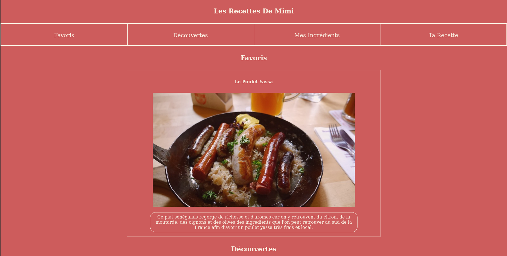
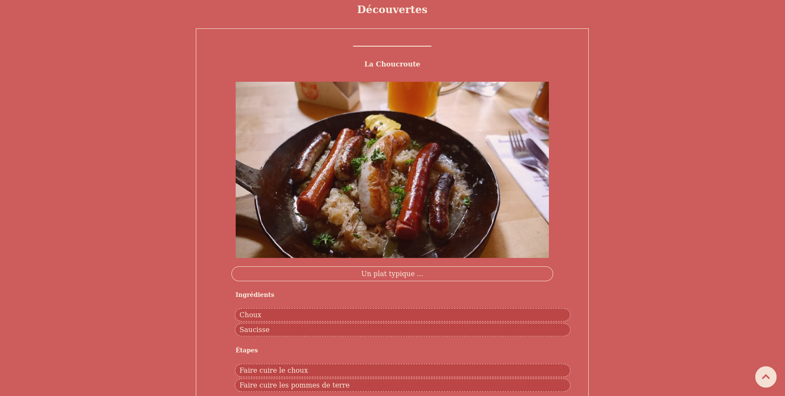
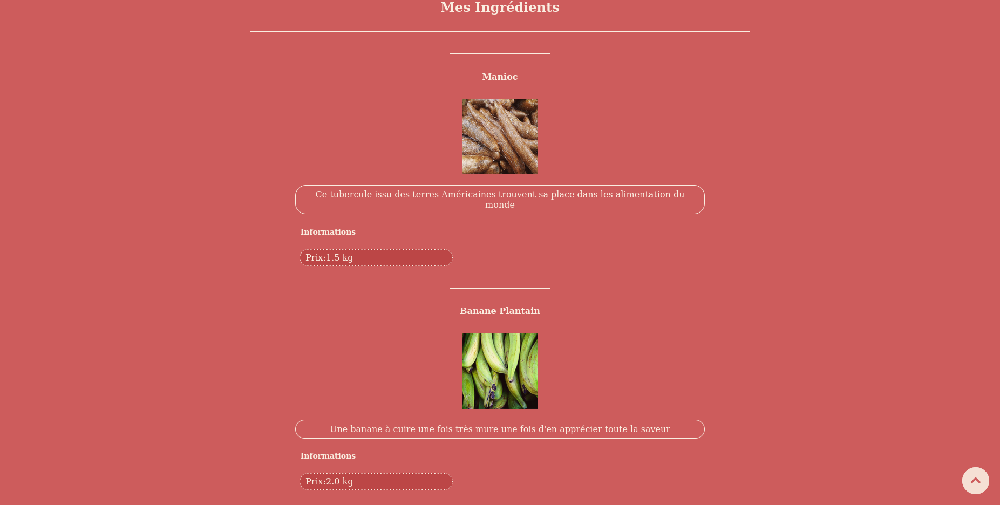
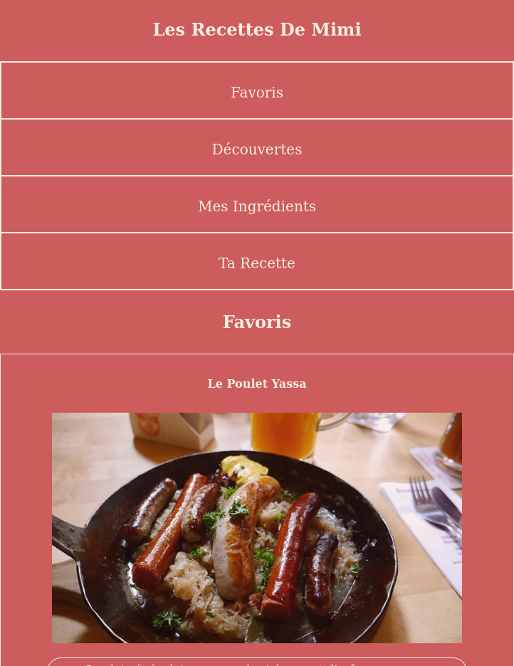
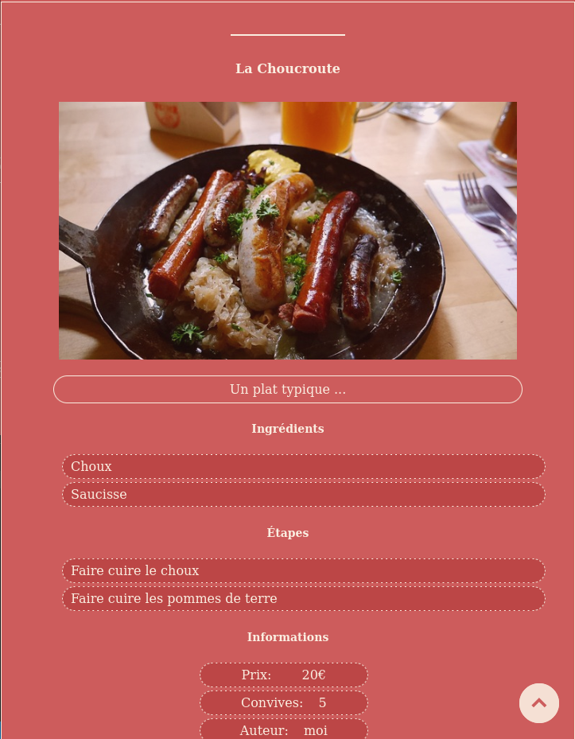
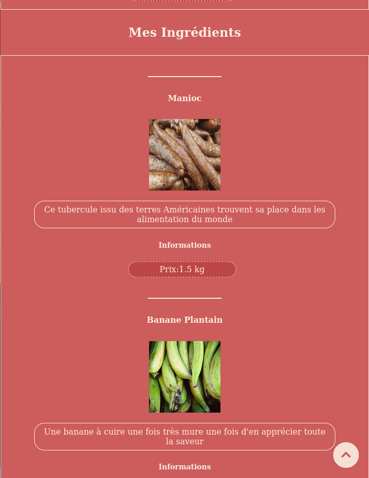
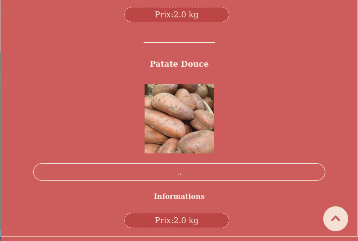
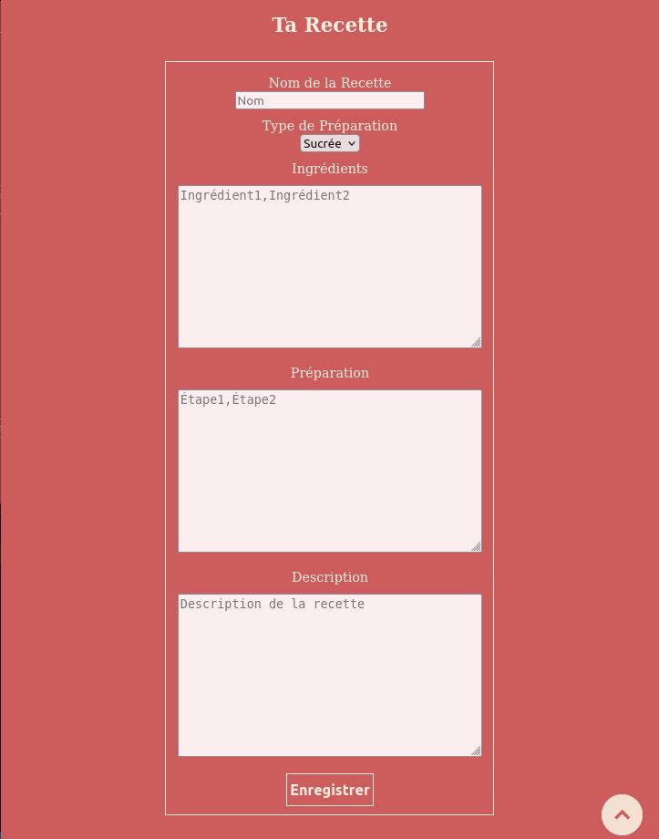

## RecipesWebsite

### Presentation
(mivindo) This is a project in collaboration with @chriSmile0. I wanted to build a new recipe website and asked for his help. First, I decided what type of content I wanted to create. 
I wanted to write recipes, with images and an interactive interface. Whether for 2, 4 or 6 people, I want the readers to be able to change the quantities or even choose the additional ingredients in real time.

## Render 

### V1.0
#### Desktop 

#### Mobile 

### V1.1 
- Upload Recipe for viewers we want to post recipe 
- NewRender (but update in next release (form update))

### V1.5 -> next release
- NoBot process
- DDOS prevention (banList, etc..)
- HomePage (NoBot)-> (choice between) MimiRecipes and ViewersRecipe

### Database Managment 
#### SQLITE3
- In command line : 
  - `sqlite3 database.db` -> open the file
  - `.tables` -> to see the table 
  - `select/delete/update/etc..` -> basic sql commands
  
- In PHP : 
  - `ìnsert_recipe/ingredient(...)` -> create element in the database
  - IN command line ->  `php db_usage.php`

- ServorAccess (SOON) and PHP or command line
- SpecialAccessHidingFile (SOON MAYBE)
- Like a visitor with the form in the end of the website (NEXT VERSION)

### Features 